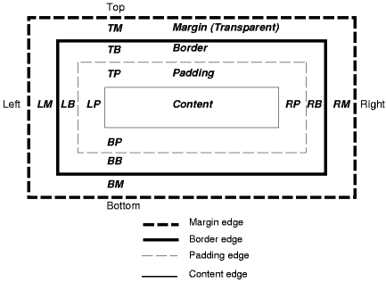

# 由浅入深漫谈margin属性



margin 在中文中我们翻译成外边距或者外补白（本文中引用外边距）。他是元素盒模型（box model）的基础属性。

**一、margin的基本特性**

margin 属性包括 margin-top, margin-right, margin-bottom, margin-left, margin，可以用来设置 box 的 margin area。属性 margin 可以用来同时设置 box 的四边外边距，而其他的 margin 属性只能设置其自各的外边距。

margin 属性可以应用于几乎所有的元素，除了表格显示类型（不包括 table-caption, table and inline-table）的元素，而且垂直外边距对非置换内联元素（non-replaced inline element）不起作用。

或许有朋友对非置换元素（non-replaced element）有点疑惑，稍微帮助大家理解一下。非置换元素，W3C 中没有给出明确的定义，但我们从字面可以理解到，非置换元素对应着置换元素（replaced element），也就是说我们搞懂了置换元素的含义，就懂了非置换元素。置换元素，[W3C](http://www.w3.org/TR/CSS21/conform.html#replaced-element)中给出了定义：

> “An element that is outside the scope of the CSS formatter, such as an image, embedded document, or applet”

从定义中我们可以理解到，置换元素（replaced element）主要是指 img, input, textarea, select, object 等这类默认就有 CSS 格式化外表范围的元素。进而可知，非置换元素（non-replaced element）就是除了 img, input, textarea, select, object 等置换元素以外的元素。

Margin对table-caption table inline-table 非置换inline元素(img input textarea select object等是置换元素)垂直方向 不起作用

margin 始终是透明的。

**二、margin 的基本写法**

外边距的 margin-width 的值类型有：auto | length | percentage

percentage：百分比是由被应用 box 的[containing block](http://www.w3.org/TR/CSS21/visuren.html#containing-block)（注：一个元素的 containing block 是该元素产生的 box(es)在计算位置和大小时参考的一个矩形——父元素）的大小所决定。对于 margin-top 和 margin-bottom 也同样成立。

margin 的默认值为 0，并且 margin 支持负值。

上面我们曾提到属性 margin 可以用来同时指定 box 的四边外边距。如果属性 margin 有四个值，那么值将按照上-右-下-左的顺序作用于四边，即从元素的上边开始，按照顺时针的顺序围绕元素。表达式如下：

```
margin：top right bottom left；
```

四个数值中间以空格分隔。效果等同于：

```
margin-top:value;
margin-right:value;
margin-bottom:value;
margin-left:value;

```

并且规范还提供了省略的数值写法，基本原则如下：

1. 如果没有 left 值，则使用 right 代替；
2. 如果没有 bottom 值，则使用 top 代替；
3. 如果没有 right 值，则使用 top 值代替。

根据这些基本原则，我们可以有三种省略方式，但不管怎样省略 margin 的数值都会大于等于一个，而 margin 的默认数值是从 top 开始至 left 结束，那么对于省略的具体情况，我们可以从 left 反推理回去。

1、如果 margin 只有三个值，按照值的顺序为 margin：top right bottom; 缺少了 left，根据原则，则 left 的值有 right 来代替。margin:10px 20px 30px; 就等于 margin:10px 20px 30px 20px;

2、如果 margin 只有两个值，按照值的顺序为 margin：top right; 缺少了 bottom 和 left，根据原则 left 的值由 right 来代替，bottm 的值由 top 来代替。margin:10px 20px; 就等于 margin:10px 20px 10px 20px;

3、如果 margin 只有一个值，按照值的顺序为 margin:top; 缺少了 bottom、left 和 right，根据原则 left 的值由 right 来代替，bottom 的值由 top 来代替，right 的值右 top 来代替，也就是说 left 的值也由 top 来代替。margin:10px; 就等于 margin:10px 10px 10px 10px;

**三、margin的解析逻辑**

目前我们已经了解到了 margin 的基本特性和基本写法，但对元素 margin 的基本解析逻辑还是很模糊，到底 margin 的 top、right、bottom、left 都是以什么为基准来促使 box model 形成。为了形象，易懂的对 margin 的逻辑进行说明，下面讲解的过程中，将引入 W3C 上没有的参考线的说法。何谓参考线？参考线就是 margin 移动的基准点，此基准点相对于 box 是静止的。而 margin 的数值，就是 box 相对于参考线的位移量。

在 margin 中 top、right、bottom、left 的参考线并不一致为一类，而是分为了两类参考线，top 和 left 的参考线属于一类，right 和bottom 的参考线属于另一类。那他们到底各以什么为参考线呢？top 以 containing block 的 content 上边或者垂直上方相连元素 margin 的下边为参考线垂直向下位移；left 以 containing block 的 content 左边或者水平左方相连元素 margin 的右边为参考线水平向右位移。right 以元素本身的 border 右边为参考线水平向右位移；bottom 以元素本身的border 下边为参考线垂直向下位移。从上我们可以看到 top 和 left 都是以外元素为参考，而 right 和 bottom 以本元素为参考。上面的位移方向是指 margin 数值为正值时候的情形，如果是负值则位移方向相反。


或许理论听起来比较枯燥，我们举例说明一下：

```
<!DOCTYPE html>
<html>
<head>
<meta charset="utf-8">
<title>无标题文档</title>
<style type="text/css">
div {
        width:200px;
        height:200px; 
        background:#ccc;
}
</style>
</head>    

<body>
        <div>外边距的margin-width的值类型有：auto | length | percentage</div>
</body>
</html>
```

如上代码，很简单，为了方便我们看到效果，我们给 div 设置了宽度和高度以及背景色。

现在我们给 div 的样式加上 margin 属性，比如：

```
margin:-10px 20px -30px 40px;
```

这时候 margin 的解析逻辑是怎样的呢？首先我们要搞清 div 的和周边元素的关系，div 没有相连元素，而此时 div 的 containing block 是 body 产生的 block box。则根据上面介绍的参考线原理，div 的左外边距以 containing block 的 content 左边为参考线，及此时以 body 的 content 左边为参考线进行水平向右位移，位移的大小为 40px，同理，上边距以 body 的 content 上边为参考线进行垂直向上位移 10px（负值和正值的方向相反），下边距依照现在 div 的 borer 下边（此时的 div 已经经过上边距位移过了）垂直向上位移 30px（此时，margin 不会改变 box 的 border 内的物理大小，但会改变 box 的逻辑大小，即：以此 box 的 margin 的下边为参考的元素，不是从 box 的物理位置开始的，而是从逻辑位置开始），右边距依照现在 div 的 borer 右边（此时的 div 已经经过左边距位移过了）水平向右位移 20px。或许有朋友问你分析的顺序怎么和 margin 表达式中出现的顺序不一样？如果按照 margin 表达式中出现的顺序来分析，结果是一样的，只是为了更好的方便大家的理解而没有按照表达式的顺序来分析。


用 margin 最后的实际显示大小的到底是怎么样呢，或许有朋友也比较疑惑，我暂时用逻辑大小和物理大小来区分（其实上面已用到此概念），到底什么是逻辑大小，什么是物理大小呢？！具体可以看图，物理大小指的是除去 margin，也就是包含 border 以内的 box 大小，而逻辑大小，则是 box 通过 margin 解析规则解析后得到的大小（这或许可以解释为什么IE5会错误解析盒模型）。在上图中，box 的实际显示的宽度等于 box 的逻辑大小，而 box 实际显示的高度等于 box 的物理大小，这说明 box 实际显示的大小可能是 box 的逻辑大小，也可能是 box的 物理大小，规则到底是怎样的——

**box 的实际大小 = box 的物理大小 + 正的 margin**

这仅对元素本身有效，对于其后面的相关元素，他们则只以 margin 的逻辑大小为准则，进行布局。

有朋友反应，听得很迷糊，越看越不懂，如果你对具体的理解过程不感兴趣的话，那记住下面我总结的结论就可以了，XD

**结论：**

box 最后的显示大小等于 box 的 border 及 border 内的大小加上正的 margin 值。而负的 margin 值不会影响 box 的实际大小，如果是负的 top 或 left 值会引起 box 的向上或向左位置移动，如果是 bottom 或 right 只会影响下面 box 的显示的参考线。


### 总结：

1 当元素是宽度是auto时候  margin-left margin-right 为负值相等于增加宽度

2 当containing box的高度auto时候 最后元素的margin-bottom设为负值 会触发containing box的高度再次计算